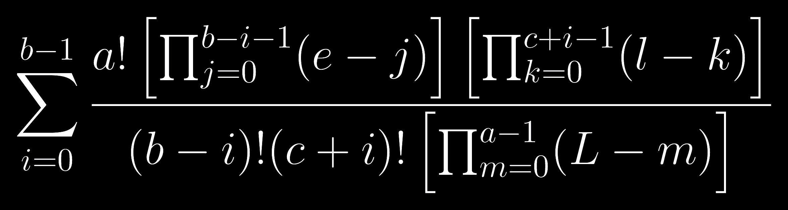

## The high-card game

Probabilities are calculated for a simplified version of poker.
Additional rules of the game will be added over time.

## Current rules:

* Players are dealt two cards each
* Five community cards are dealt
* A hand is the single best card, not the five best cards. 
* Community cards are not in play.
* The player with the highest card (from their hole cards) wins. 

## Fun with math:

E: Known, set of cards in your hand and on the table.

D: Unknown, set of all other cards.

Rank(c): Rank of a card. 

* Rank(A) = 14, Rank(K) = 13, ... , Rank(J) = 11, Rank(10) = 10, ... , Rank(2) = 2. 

Count(c): The count of a given card in E.

* If there is a Jack in your hand and one on the table, Count(J) = 2. 

Low(c): The count of cards of lower rank than a given card in E.

High(c): The count of cards of a higher rank than a given card in E.

### Probability of a Draw

With the current rules, a draw is when two or more players share the high card. 
This formula calculates the probability that at least one other player has at least one card of the same rank (the high card). 

$a$ is the count of cards dealt to other players;

$b = 3$ (the count of suits in the deck less one);

$c=a-b$;

$e = 4 - \text{Count(c)}$, the count of drawing cards in D;

$l = 4 (\text{Rank(c)} - 2) - \text{Low(c)}$, the count of lower ranked cards in D;

$L = |D| = 52 - |E|$, the cardinality of D, or the count of cards in D.
